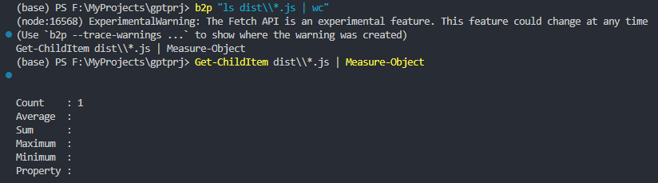

# b2p: Linux Bash to PowerShell Translator
With our advanced natural language understanding capabilities, we have designed a console tool that translates Linux commands into PowerShell commands. 
This tool will make your experience with PowerShell more seamless, especially if you are already familiar with Linux and find the PowerShell commands challenging to recall.

## Download
Download the app from the [release page](https://github.com/rximg/b2p/releases/download/0.0.1/b2p.exe) and copy b2p.exe into the Windows folder in the system drive.

## Configure API Key
To obtain the API key, visit the OpenAI official website. Then, set the API key in a JSON file located in  %USERPROFILE%\\.psgpt.

```{"apiKey":"your api key"}```

## Usage:
Use the repository as follows:

```b2p ls *.jpg```

You can also wrap the command with  if there are characters in the command that need to be escaped. For example, characters like '|' need to be escaped, like so:

```b2p 'ls *.jpg  | wc'```


## Development
#### package
```npx webpack```
#### release 
```pkg dist/b2p.js --target node18-win-x64```

## Future plans
1. To change the configuration item to be input by natural language and parsed and executed by GPT.
2. Add proxy support if required.
3. Optimize the packaging issue.